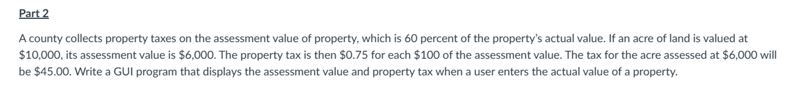
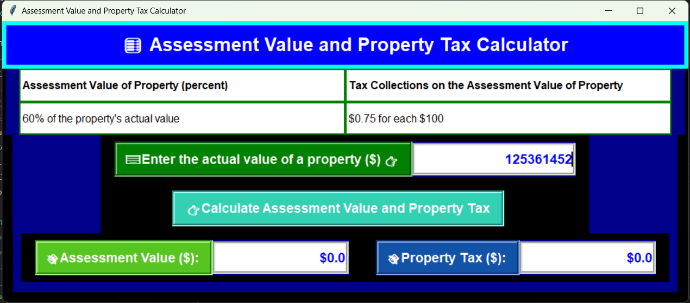

# Lab3 - Part2 - Guidance: 


<br>

# Run the Program:
### 1. Open the terminal window.
### 2. Change the directory to where the file is located.
### 3. Run the following command:
```bash
> python Main_GUI.py
```
<br>

# Output:




