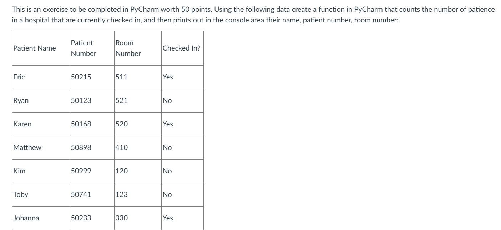

# 

 

  

# Patient Checked in program

# 1. Introduction + Prompt:

# 2. Output:
>\*\*\*This is Sharp Hospital Patient Checking Data App\*\*\*

>Here are the patients that are currently checked in:

>Patient Name: Eric. Patient Number: 50215. Room Number: 511

>Patient Name: Karen. Patient Number: 50168. Room Number: 520

>Patient Name: Johanna. Patient Number: 50233. Room Number: 330
