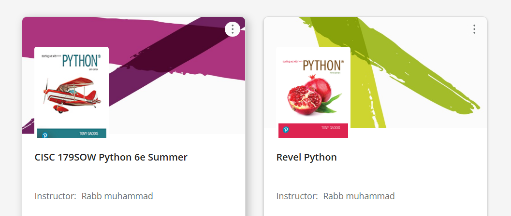
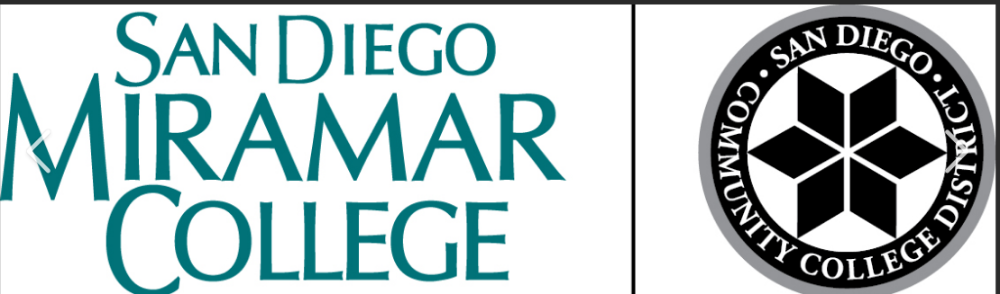
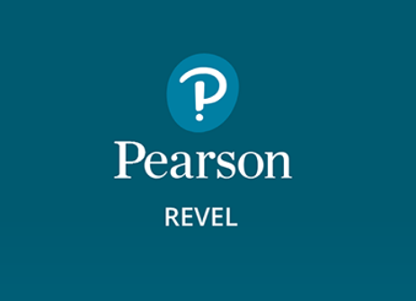
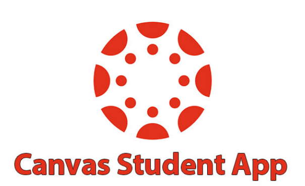

  

# 'CISC_179_college_class_projects' child repository of 'Python_projects' repository contains all of the Python projects from Computer Information Science 179: Python Programming class at San Diego Miramar College.

 

## ⚠️💻 This class uses the Pearson Revel Platform to help students study and work with Python programming language 💻⚠️

## ❇️ All the projects include syntaxes that are written by me and my professor Rabb muhammad.❇️

  

# 2. College:

    

# 3. Platform:

 

