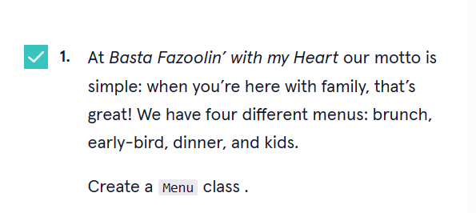
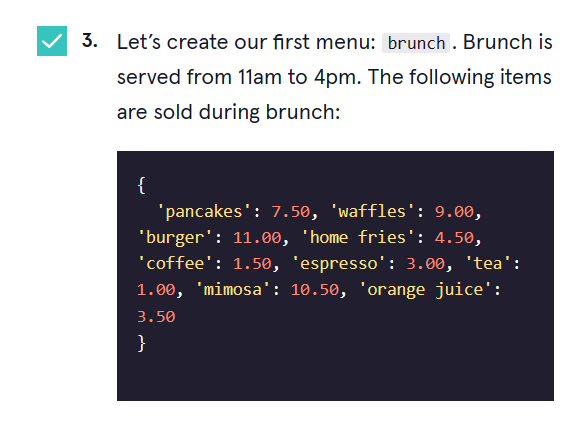

# 


 <a type="button" title="Codecademy_Learn_Python3_Course_button" href="https://www.codecademy.com/courses/learn-python-3/projects/basta-fazoolin" target="_blank" data-CodecademyLearnPython3CourseButt="CodecademyLearnPython3CourseButt_data"></a>


<br><br>


# Basta Fazoolin'

# 1. Introduction:

> You’ve started a position as the lead programmer for the family-style Italian restaurant Basta Fazoolin’ with My Heart. The restaurant has been doing fantastically and seen a lot of growth lately. You’ve been hired to keep things organized.


# 2. Output:
> 13.5
[brunch menu available from 11:00:AM to 16:00:PM, kids menu available from 11:00:AM to 9:00:PM]
[early_bird menu available from 3:00:PM to 6:00:PM, kids menu available from 11:00:AM to 9:00:PM]
Address: 189 Fitzgerald Avenue
Take a' Arepa menu available from 10:00:AM to 8:00:PM

# 3. Prompts:

```python
class Menu:
```

```python
class Menu:
  def __init__(self,name,items,start_time,end_time):
    self.name = name
    self.items = items
    self.start_time = start_time
    self.end_time = end_time
```


```python
brunch_items = {
  'pancakes': 7.50, 'waffles': 9.00, 'burger': 11.00, 'home fries': 4.50, 'coffee': 1.50, 'espresso': 3.00, 'tea': 1.00, 'mimosa': 10.50, 'orange juice': 3.50
}

brunch = Menu("brunch",brunch_items,"11:00:AM","16:00:PM")

```


```python 
early_bird_items = {
  'salumeria plate': 8.00, 'salad and breadsticks (serves 2, no refills)': 14.00, 'pizza with quattro formaggi': 9.00, 'duck ragu': 17.50, 'mushroom ravioli (vegan)': 13.50, 'coffee': 1.50, 'espresso': 3.00,
}

early_bird = Menu("early_bird",early_bird_items,"3:00:PM","6:00:PM")


dinner_items = {
  'crostini with eggplant caponata': 13.00, 'caesar salad': 16.00, 'pizza with quattro formaggi': 11.00, 'duck ragu': 19.50, 'mushroom ravioli (vegan)': 13.50, 'coffee': 2.00, 'espresso': 3.00,
}

dinner = Menu('dinner',dinner_items,"5:00:PM","11:00:PM")


kids_items = {
  'chicken nuggets': 6.50, 'fusilli with wild mushrooms': 12.00, 'apple juice': 3.00
}

kids = Menu('kids',kids_items,"11:00:AM","9:00:PM")

```

```python
def __repr__(self):
    return "{} menu available from {} to {}".format(self.name,self.start_time,self.end_time)
```


```python
 def calculate_bill(self,purchased_items):
    total_price = 0
    for item in purchased_items:
      if item in self.items:
        total_price+=self.items.get(item)
    return total_price
```


```python
class Franchise:
  def __init__(self,address,menus):
    self.address = address
    self.menus = menus
```

### You can put <b>Franchise</b> class into the top of the file to manage easier.


```python
flagship_store = Franchise("1232 West End Road",[brunch,early_bird,dinner,kids])

new_installment = Franchise("12 East Mulberry Street",[brunch,early_bird,dinner,kids])
```


```python
def __repr__(self):
    return "Address: {}".format(self.address)
```


```python

def available_menus(self,time):
    list_of_avail_menus = []
    for item in self.menus:
      if time >= item.start_time and time <= item.end_time:
        list_of_avail_menus.append(item)
  
    return list_of_avail_menus

```


```python
print(flagship_store.available_menus("12:00:PM"))
```


```python
class Business:
  def __init__(self,name,franchises):
    self.name = name
    self.franchises = franchises

basta = Business("Basta Fazoolin",[flagship_store,new_installment])
```


```python

arepas_items = {
  'arepa pabellon': 7.00, 'pernil arepa': 8.50, 'guayanes arepa': 8.00, 'jamon arepa': 7.50
}
arepas_menu = Menu("Take a' Arepa",arepas_items,"10:00:AM","8:00:PM")
```


```python
arepas_place = Franchise("189 Fitzgerald Avenue",[arepas_menu])
```


```python
arepa = Business("Take a' Arepa",[arepas_place])

#Testing

print(arepa.franchises[0])
print(arepa.franchises[0].menus[0])
```