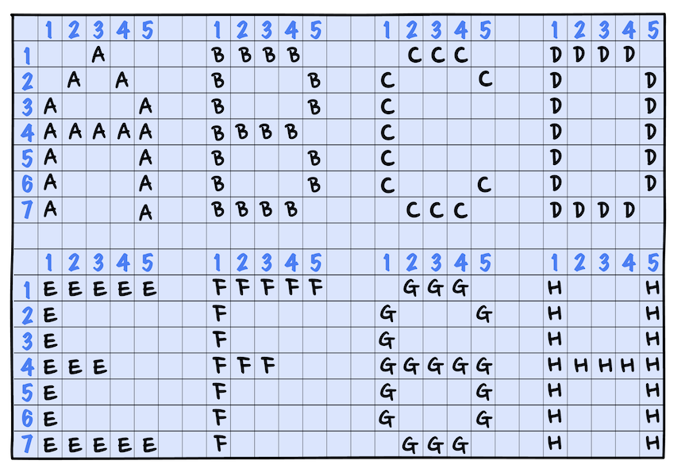
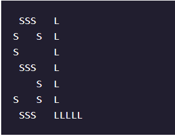

# 

 

  

# Block Letters

# 1. Introduction:

[ASCII](https://en.wikipedia.org/wiki/ASCII_art) art is a graphic design technique that uses computers for presentation and consists of pictures pieced together from individual characters.

Write a Python program called <b>initials.py</b> that displays the initials of your name in block letters as shown and dip your toes into ASCII art.

Happy coding!

# 2. Output:

# 3. Prompts:

> 1. Take a look at the [complete alphabet](https://content.codecademy.com/courses/learn-cpp/hello-world/block-letters-hint.png?_gl=1*sqx9zi*_ga*OTU3OTgwOTk5My4xNjg1MzM2MjE1*_ga_3LRZM6TM9L*MTY4OTczNTIyMi43Ny4xLjE2ODk3MzUyMzAuNTIuMC4w) and find your initials. Notice how each block letter is 7x5 and formed by the letter itself.  
My initials are S and L, so my <b>initials.py</b> program should output:

> Once you are ready, mark this task complete by checking off the box.  
<b>initials.py</b> should use multiple <b>print()</b> statements to output your initials in block letters.  
The numbers in the grid are there to help represent the dimensions of each block letter; you shouldn’t include the numbers in your strings.

 

> 2. First, write two comments with:
>> - Your first and last name.
>> - A fun fact about yourself.

 

> 3. Output your first initial as a block letter. There are a few ways to do this!  
Press <b>Save</b> to run your program.

 

> 4. Output your second initial as a block letter by adding to the <b>print()</b> statements.  
Press <b>Save</b> to run your program.

 

> 5. Don’t forget to check off all the tasks before moving on.  
Sample solutions:
>> - [initials.py](https://github.com/Codecademy/learn-python/blob/main/1-hello-world/block-letters/initials.py)
>> - [snowman.py](https://github.com/Codecademy/learn-python/blob/main/1-hello-world/block-letters/snowman.py)   
P.S. If you make something cool, share it with us!