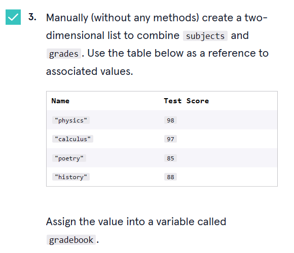

# 


 <a type="button" title="Codecademy_Learn_Python3_Course_button" href="https://www.codecademy.com/courses/learn-python-3/projects/python-gradebook" target="_blank" data-CodecademyLearnPython3CourseButt="CodecademyLearnPython3CourseButt_data"></a>


<br><br>


# Gradebook

# 1. Introduction:
You are a student and you are trying to organize your subjects and grades using Python. Let’s explore what we’ve learned about lists to organize your subjects and scores.


# 2. Output:


# 3. Prompts:

> 1. Create a list called <b>subjects</b> and fill it with the classes you are taking:<br><br>
>> - "physics"
>> - "calculus"
>> - "poetry"
>> - "history"
```python
subjects = ["physics","calculus","poetry","history"]
```

<br>

> 2. Create a list called <b>grades</b> and fill it with your scores:<br><br>
>> - 98
>> - 97
>> - 85
>> - 88
```python
grades = [98,97,85,88]
```

<br>

> 3. 

```python
gradebook = [["physics",98],["calculus",97],["poetry",85],["history",88]]
```
<br>

> 4. Print <b>gradebook</b>

### Add More Subjects:

<br>

> 5. Your grade for your computer science class just came in! You got a perfect score, <b>100!</b><br><br>
Use the <b>.append()</b> method to add a list with the values of <b>"computer science"</b> and an associated grade value of <b>100</b> to our two-dimensional list of <b>gradebook</b>.
```python
gradebook.append(["computer science",100])
```

<br>

> 6. Your grade for <b>"visual arts"</b> just came in! You got a <b>93!</b><br><br>
Use <b>append</b> to add <b>["visual arts", 93]</b> to <b>gradebook</b>.
```python
gradebook.append(["visual arts",93])
```

<br>

### Modify The Gradebook:

<br>


> 7. Our instructor just told us they made a mistake grading and are rewarding an extra 5 points for our visual arts class.<br><br>
Access the index of the grade for your visual arts class and modify it to be 5 points greater. 
```python
gradebook[-1][-1] += 5
```

<br>

> 8. You decided to switch from a numerical grade value to a Pass/Fail option for your poetry class.<br><br>
Find the grade value in your <b>gradebook</b> for your poetry class and use the <b>.remove()</b> method to delete it.
```python
gradebook[2].remove(85)

```

<br>

> 9. Use the <b>.append()</b> method to then add a new <b>"Pass"</b> value to the sublist where your poetry class is located.
```python
gradebook[2].append('Pass')
```

<br>

### One Big Gradebook!

<br>

> 10. You also have your grades from last semester, stored in <b>last_semester_gradebook</b>.<br><br>
Create a new variable <b>full_gradebook</b> that combines both <b>last_semester_gradebook</b> and <b>gradebook</b> using <b>+</b> to have one complete grade book.<br><br>
Print <b>full_gradebook</b> to see our completed list.
```python
full_gradebook = last_semester_gradebook + gradebook

print(full_gradebook)
```