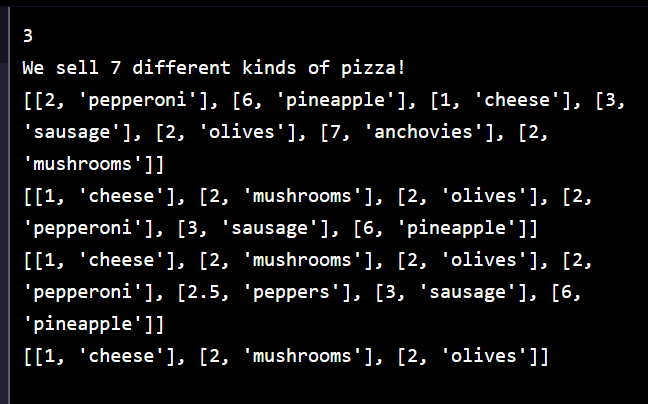
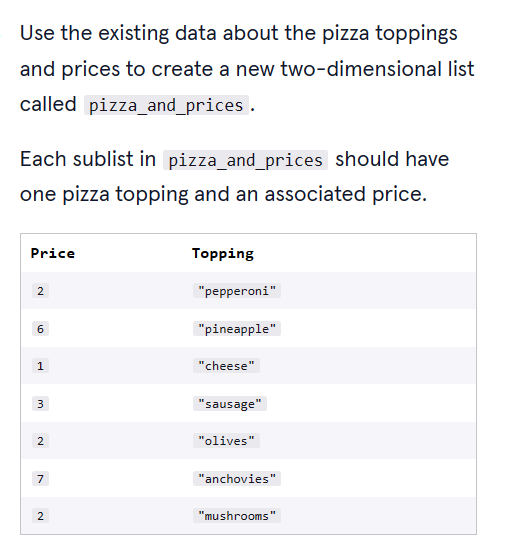
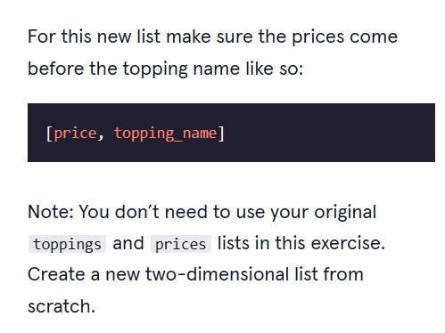

# 


 <a type="button" title="Codecademy_Learn_Python3_Course_button" href="https://www.codecademy.com/courses/learn-python-3/projects/python-lens-slice" target="_blank" data-CodecademyLearnPython3CourseButt="CodecademyLearnPython3CourseButt_data"></a>


<br><br>


# Len's Slice

# 1. Introduction:
You work at Len’s Slice, a new pizza joint in the neighborhood. You are going to use your knowledge of Python lists to organize some of your sales data.


# 2. Output:


# 3. Prompts:

### Make Some Pizzas

> 1. To keep track of the kinds of pizzas you sell, create a list called <b>toppings</b> that holds the following:
>> - "pepperoni"
>> - "pineapple"
>> - "cheese"
>> - "sausage"
>> - "olives"
>> - "anchovies"
>> - "mushrooms"
```python
toppings = ["pepperoni","pineapple","cheese","sausage","olives","anchovies","mushrooms"]
```

<br>

> 2. To keep track of how much each kind of pizza slice costs, create a list called <b>prices</b> that holds the following integer values:
>> - 2
>> - 6
>> - 1
>> - 3
>> - 2
>> - 7
>> - 2
```python
prices = [2,6,1,3,2,7,2]
```

<br>

> 3. Your boss wants you to do some research on $2 slices.<br><br>
Count the number of occurrences of <b>2</b> in the <b>prices</b> list, and store the result in a variable called <b>num_two_dollar_slices</b>. Print it out.

```python
num_two_dollar_slices = prices.count(2)

print(num_two_dollar_slices)
```
<br>

> 4. Find the length of the <b>toppings</b> list and store it in a variable called <b>num_pizzas</b>.
```python
num_pizzas = len(toppings)
```

<br>

> 5. Print the string <b>We sell [num_pizzas] different kinds of pizza!</b>, where <b>[num_pizzas]</b> represents the value of our variable <b>num_pizzas</b>.
```python
print("We sell",num_pizzas,"different kinds of pizza!")
```

<br>

> 6. 


```python
pizza_and_prices = [[2,"pepperoni"],[6,"pineapple"],[1,"cheese"],[3,"sausage"],[2,"olives"],[7,"anchovies"],[2,"mushrooms"]]
```

<br>

> 7. Print <b>pizza_and_prices</b>.

<br>

### Sorting and Slicing Pizzas

<br>

> 8. Sort <b>pizza_and_prices</b> so that the pizzas are in the order of increasing price (ascending).
```python
pizza_and_prices.sort()
```
<br>

> 9. Store the first element of <b>pizza_and_prices</b> in a variable called <b>cheapest_pizza</b>.
```python
cheapest_pizza = pizza_and_prices[0]
```
<br>

> 10. A man walks into the pizza store and shouts “I will have your MOST EXPENSIVE pizza!”<br><br>
Get the last item of the <b>pizza_and_prices</b> list and store it in a variable called <b>priciest_pizza</b>.
```python
priciest_pizza = pizza_and_prices[-1]
```
<br>

> 11. It looks like the most expensive pizza from the previous step was our very last <b>"anchovies"</b> slice. Remove it from our <b>pizza_and_prices</b> list since the man bought the last slice.
```python
pizza_and_prices.pop()
```

<br>

> 12. Since there is no longer an <b>"anchovies"</b> pizza, you want to add a new topping called <b>"peppers"</b> to keep your customers excited about new toppings. Here is what your new topping looks like:<br><br>
[2.5, "peppers"]<br><br>
Add the new peppers pizza topping to our list <b>pizza_and_prices</b>.<br><br>
<b>Note</b>: Make sure to position it relative to the rest of the sorted data in <b>pizza_and_prices</b>, otherwise our data will not be correctly sorted anymore!<br><br>
Since the new pizza has a price of <b>2.5</b>, it should come after <b>[2, "pepperoni"]</b> but before <b>[3, "sausage"]</b>.<br><br>
You can use the <b>.insert()</b> method to insert an element at a specific index.
```python
pizza_and_prices.insert(-2,[2.5,"peppers"])
```

<br>

> 13. Three mice walk into the store. They don’t have much money (they’re mice), but they do each want different pizzas.<br><br>
Slice the <b>pizza_and_prices</b> list and store the 3 lowest cost pizzas in a list called <b>three_cheapest</b>.
```python
three_cheapest = pizza_and_prices[:3]
```

<br>

> 14. Great job! The mice are very pleased and will be leaving you a 5-star review.<br><br>
Print the <b>three_cheapest</b> list.
```python
print(three_cheapest)
```
