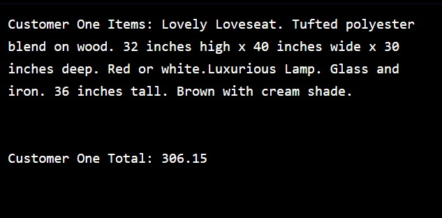

# 


 <a type="button" title="Codecademy_Learn_Python3_Course_button" href="https://www.codecademy.com/courses/learn-python-3/projects/python-furniture-store" target="_blank" data-CodecademyLearnPython3CourseButt="CodecademyLearnPython3CourseButt_data"></a>


<br><br>


# Receipts for Lovely Loveseats

# 1. Introduction:
We’ve decided to pursue the dream of small-business ownership and open up a furniture store called Lovely Loveseats for Neat Suites on Fleet Street. With our newfound knowledge of Python programming, we’re going to build a system to help speed up the process of creating receipts for your customers.

In this project, we will be storing the names and prices of a furniture store’s catalog in variables. You will then process the total price and item list of customers, printing them to the output terminal.

<b>Please note</b>: Projects do not run tests against your code. This experience is more open to your interpretation and gives you the freedom to explore. Remember that all variables must be declared before they are referenced in your code.

If you get stuck during this project or would like to see an experienced developer work through it, click “<b>Get Unstuck</b>“ to see a <b>project walkthrough video</b>.


# 2. Output:


# 3. Prompts:

## Adding In The Catalog

> 1. Let’s add in our first item, the Lovely Loveseat that is the store’s namesake. Create a variable called <b>lovely_loveseat_description</b> and assign to it the following string:<br><br>
Lovely Loveseat. Tufted polyester blend on wood. 32 inches high x 40 inches wide x 30 inches deep. Red or white.
```python
variable_name = "This is a string"
```

<br>

> 2. Great, now let’s create a price for the loveseat. Create a variable <b>lovely_loveseat_price</b> and set it equal to <b>254.00</b>.
```python
lovely_loveseat_price = 254.00
```

<br>

> 3. Let’s extend our inventory with another characteristic piece of furniture! Create a variable called <b>stylish_settee_description</b> and assign to it the following string:<br><br>
Stylish Settee. Faux leather on birch. 29.50 inches high x 54.75 inches wide x 28 inches deep. Black.

<br>

> 4. Now let’s set the price for our Stylish Settee. Create a variable <b>stylish_settee_price</b> and assign it the value of <b>180.50</b>.

<br>

> 5. Fantastic, we just need one more item before we’re ready for business. Create a new variable called <b>luxurious_lamp_description</b> and assign it the following:<br><br>
Luxurious Lamp. Glass and iron. 36 inches tall. Brown with cream shade.

<br>

> 6. Let’s set the price for this item. Create a variable called <b>luxurious_lamp_price</b> and set it equal to <b>52.15</b>.

<br>

> 7. In order to be a business, we should also be calculating sales tax. Let’s store that in a variable as well.<br><br>
Define the variable <b>sales_tax</b> and set it equal to <b>.088</b>. That’s 8.8%.

<br>

> 8. Our first customer is making their purchase! Let’s keep a running tally of their expenses by defining a variable called <b>customer_one_total</b>. Since they haven’t purchased anything yet, let’s set that variable equal to <b>0</b> for now.

<br>

> 9. We should also keep a list of the descriptions of things they’re purchasing. Create a variable called <b>customer_one_itemization</b> and set that equal to the empty string <b>""</b>. We’ll tack on the descriptions to this as they make their purchases.

<br>

> 10. Our customer has decided they are going to purchase our Lovely Loveseat! Add the price to <b>customer_one_total</b>.<br><br>
The price for the loveseat is saved in <b>lovely_loveseat_price</b>. Add it to the total like so:<br>
```python
customer_one_total += lovely_loveseat_price
```


<br>

> 11. Let’s start keeping track of the items our customer purchased. Add the description of the Lovely Loveseat to <b>customer_one_itemization</b>.<br><br>
The description is in the <b>lovely_loveseat_description</b> variable. Recall you can use the plus-equals operator to add strings to an existing variable.
```python
customer_one_itemization += lovely_loveseat_description
```

<br>

> 12. Our customer has also decided to purchase the Luxurious Lamp! Let’s add the price to the customer’s total.
```python
customer_one_total += lovely_loveseat_price + luxurious_lamp_price
```
<br>

> 13. Let’s keep the itemization up-to-date and add the description of the Luxurious Lamp to our itemization.
<br><br>

> 14. They’re ready to check out! Let’s begin by calculating sales tax. Create a variable called <b>customer_one_tax</b> and set it equal to <b>customer_one_total</b> times <b>sales_tax</b>.
```python
 customer_one_tax = customer_one_total * sales_tax
 ```
 <br>

 > 15. Add the sales tax to the customer’s total cost.
 ```python
 customer_one_total += lovely_loveseat_price + luxurious_lamp_price + customer_one_tax
 ```

 <br>

 > 16. Let’s start printing up their receipt! Begin by printing out the heading for their itemization. Print the phrase <b>"Customer One Items:"</b>.
 ```python
 print("Customer One Items: "+customer_one_itemization)
 ```

 <br>

 > 17. Print <b>customer_one_itemization</b>.

 <br>

 > 18. Now add a heading for their total cost: Print out <b>"Customer One Total:"</b>

 <br>

 > 19. Now add a heading for their total cost: Print out "Customer One Total:"
 ```python
 print("Customer One Total: "+str(customer_one_total))
 ```

 <br>

 > 20. Congratulations! We created our catalog and served our first customer. We used our knowledge of strings and numbers to create and update variables. We were able to print out an itemized list and a total cost for our customer. Lovely!


