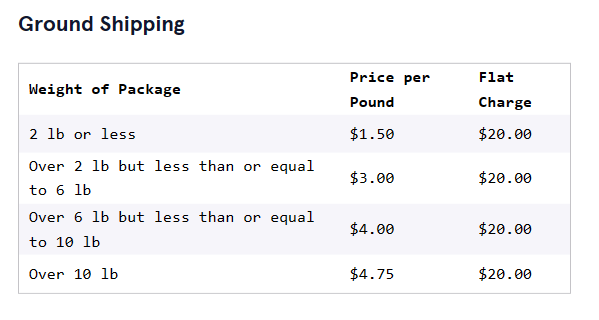
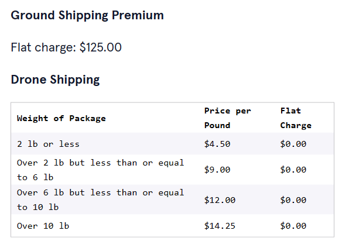

# 


 <a type="button" title="Codecademy_Learn_Python3_Course_button" href="https://www.codecademy.com/courses/learn-python-3/projects/python-sals-shipping" target="_blank" data-CodecademyLearnPython3CourseButt="CodecademyLearnPython3CourseButt_data"></a>


<br><br>


# Sal's Shipping

# 1. Introduction:
 Sal runs the biggest shipping company in the tri-county area, Sal’s Shippers. Sal wants to make sure that every single one of his customers has the best, and most affordable experience shipping their packages.<br><br>
In this project, you’ll build a program that will take the weight of a package and determine the cheapest way to ship that package using Sal’s Shippers.<br><br>
Sal’s Shippers has several different options for a customer to ship their package:<br><br>
- Ground Shipping, which is a small flat charge plus a rate based on the weight of your package.<br><br>
- Ground Shipping Premium, which is a much higher flat charge, but you aren’t charged for weight.<br><br>
- Drone Shipping (new), which has no flat charge, but the rate based on weight is triple the rate of ground shipping.

<br>

Here are the prices:<br><br>




Write a <b>shipping.py</b> Python program that asks the user for the weight of their package and then tells them which method of shipping is cheapest and how much it will cost to ship their package using Sal’s Shippers.<br><br>
Note that the walkthrough video for this project is slightly out of date — the walkthrough was done using a version of this project that uses functions. Feel free to come back to the video after having been introduced to functions!


# 2. Output:
> Ground shipping \$400.0 <br>
Ground Shipping Premium \$125.0<br>
Drone shipping \$1140.0<br>

# 3. Prompts:

> 1. First things first, define a <b>weight</b> variable and set it equal to any number.
```python
weight = 80
```
<br><br>

> 2. Next, we need to know how much it costs to ship a package of given weight by normal ground shipping based on the “Ground shipping” table above.<br><br>
Write a comment that says “Ground Shipping”.<br><br>
Create an <b>if/elif/else</b> statement for the cost of ground shipping. It should check for <b>weight</b>, and print the <b>cost</b> of shipping a package of that weight.
```python
#Your if statement should take a form similar to:

# “Ground Shipping”
if weight <= 2:
  cost_ground = weight*1.5+20
elif weight > 2 and weight <= 6:
  cost_ground = weight*3+20
elif weight > 6 and weight <= 10:
  cost_ground = weight*4+20
elif weight > 10:
  cost_ground = weight*4.75+20
else:
  cost_ground = "Unknown"
```
<br>

> 3. A package that weighs 8.4 pounds should cost $53.60 to ship with normal ground shipping:
>>>> 8.4lb X $4.00 + $20.00 = $53.60<br><br>
Test that your ground shipping function gets the same value.<br><br>

### Ground Shipping Premium:
<br>

> 4. We’ll also need to make sure we include the price of premium ground shipping in our code.<br><br>
Create a variable for the cost of premium ground shipping.<br><br>
<b>Note:</b> This does not need to be an <b>if</b> statement because the price of premium ground shipping does not change with the weight of the package.

The Ground Shipping Premium has a flat fee of $125.00:
```python
cost_ground_premium = 125.00
```
<br>

> 5. Print it out for the user just in case they forgot!
```python
cost_ground_premium = 125.00
 
print("Ground Shipping Premium $", cost_ground_premium)
```

<br>

### Drone Shipping:

<br>

> 6. Write a comment for this section of the code, <b>“Drone Shipping”</b>.<br><br>
Create an <b>if/elif/else</b> statement for the cost of drone shipping. This statement should check against <b>weight</b> and print the <b>cost</b> of shipping a package of that weight.
```python
# "Drone Shipping"
if weight <= 2:
  cost_drone = weight*4.5
elif weight > 2 and weight <= 6:
  cost_drone = weight*9
elif weight > 6 and weight <= 10:
  cost_drone = weight*12
elif weight > 10:
  cost_drone = weight*14.25
else:
  cost_drone = "Unknown"
```

<br>

> 7. A package that weighs 1.5 pounds should cost $6.75 to ship by drone:<br><br>
1.5lb X $4.50 + $0.00 = $6.75 <br><br>
Test that your drone shipping calculation gets the same value.

<br>

> 8. Great job! Now, test everything one more time!<br><br>
What is the cheapest method of shipping a 4.8 pound package and how much would it cost?<br><br>
What is the cheapest method of shipping a 41.5 pound package and how much would it cost?<br><br>
(See hint for answers)

For 4.8 pounds, ground shipping is the cheapest:

> Ground Shipping \$34.4 <br>
Ground Shipping Premium \$125.0<br>
Drone Shipping: \$43.199999999999996<br>

For 41.5 pounds, ground shipping premium is the cheapest:

> Ground Shipping \$217.125<br>
Ground Shipping Premium $125.0<br>
Drone Shipping: $591.375<br>

<br>

> 9. Don’t forget to check off all the tasks before moving on.<br><br>
Sample solutions:

>> - [shipping.py](https://github.com/Codecademy/learn-python/blob/main/2-control-flow/sals-shipping/shipping.py)

> P.S. If you make something cool, share it with us!