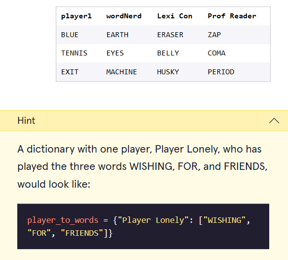

# 


 <a type="button" title="Codecademy_Learn_Python3_Course_button" href="https://www.codecademy.com/courses/learn-python-3/projects/scrabble" target="_blank" data-CodecademyLearnPython3CourseButt="CodecademyLearnPython3CourseButt_data"></a>


<br><br>


# Scrabble

# 1. Introduction:
In this project, you will process some data from a group of friends playing scrabble. You will use dictionaries to organize players, words, and points.

There are many ways you can extend this project on your own if you finish and want to get more practice!

# 2. Output:

# 3. Prompts:

> 1. We have provided you with two lists, <b>letters</b> and <b>points</b>. We would like to combine these two into a dictionary that would map a letter to its point value.<br><br>
Using a list comprehension and <b>zip</b>, create a dictionary called <b>letter_to_points</b> that has the elements of <b>letters</b> as the keys and the elements of <b>points</b> as the values.
```python
letter_to_points = {key:value for key,value in zip(letters,points)}
```
<br><br>

> 2. Our <b>letters</b> list did not take into account blank tiles. Add an element to the <b>letter_to_points</b> dictionary that has a key of <b>" "</b> and a point value of <b>0</b>.
```python
letter_to_points[" "] = 0
```
<br><br>

### Score a Word

<br>


> 3. We want to create a function that will take in a word and return how many points that word is worth.<br><br>
Define a function called <b>score_word</b> that takes in a parameter <b>word</b>.

<br><br>

> 4. Inside <b>score_word</b>, create a variable called <b>point_total</b> and set it to <b>0</b>.
```python
def score_word(word):
  point_total =0
```

<br><br>

> 5. After defining <b>point_total</b>, create a for loop that goes through the letters in <b>word</b> and adds the point value of each letter to <b>point_total</b>.<br><br>
You should get the point value from the <b>letter_to_points</b> dictionary. If the letter you are checking for is not in <b>letter_to_points</b>, add 0 to the <b>point_total</b>.

<br><br>

> 6. After the for loop is finished, return <b>point_total</b>.
```python
def score_word(word):
  point_total =0
  for num in word:
    if letter_to_points.get(num,0) == 0:
      point_total+=0
    if letter_to_points.get(num,0) != 0:
      point_total+=letter_to_points[num]
    
  return point_total
```
<br><br>

> 7. Let’s test this function! Create a variable called <b>brownie_points</b> and set it equal to the value returned by the <b>score_word()</b> function with an input of <b>"BROWNIE"</b>.
```python
brownie_points = score_word("BROWNIE")
```
<br><br>

> 8. We expect the word BROWNIE to earn 15 points:<br><br>
(B + R + O + W + N + I + E)<br><br>
(3 + 1 + 1 + 4 + 4 + 1 + 1) = 15<br><br>
Let’s print out <b>brownie_points</b> to make sure we got it right.
```python
print(brownie_points)
```

### Score a Game

> 9. Create a dictionary called <b>player_to_words</b> that maps players to a list of the words they have played. This table represents the data to transcribe into your dictionary:

```python
player_to_words = {"player1":["Blue","TENNIS","EXIT"],"wordNerd":["EARTH","EYES","MACHINE"],"Lexi Con":["ERASER","BELLY","HUSKY"],"Prof Reader":["ZAP","COMA","PERIOD"]}
```

<br>

> 10. Create an empty dictionary called <b>player_to_points</b>.

<br>

> 11. Iterate through the items in <b>player_to_words</b>. Call each player <b>player</b> and each list of words <b>words</b>.<br><br>
Within your loop, create a variable called <b>player_points</b> and set it to <b>0</b>.
```python
player_to_points = {}

for player,words in player_to_words.items():
  player_points = 0
```
<br>

> 12. Within the loop, create another loop that goes through each <b>word</b> in <b>words</b> and adds the value of <b>score_word()</b> with <b>word</b> as an input.
```python
player_to_points = {}

for player,words in player_to_words.items():
  player_points = 0
  for word in words:
    player_points+=score_word(word)
```
<br>

> 13. After the inner loop ends, set the current <b>player</b> value to be a key of <b>player_to_points</b>, with a value of <b>player_points</b>.
```python
  player_to_points[player] = player_points
```
<br>

> 14. <b>player_to_points</b> should now contain the mapping of players to how many points they’ve scored. Print this out to see the current standings for this game!<br><br>
If you’ve calculated correctly, wordNerd should be winning by 1 point.

<br>

> 15. If you want extended practice, try to implement some of these ideas with the Python you’ve learned:<br><br>
>> - <b>play_word()</b> — a function that would take in a player and a word, and add that word to the list of words they’ve played<br><br>
>> - <b>update_point_totals()</b> — turn your nested loops into a function that you can call any time a word is played<br><br>
>> - make your <b>letter_to_points</b> dictionary able to handle lowercase inputs as well


