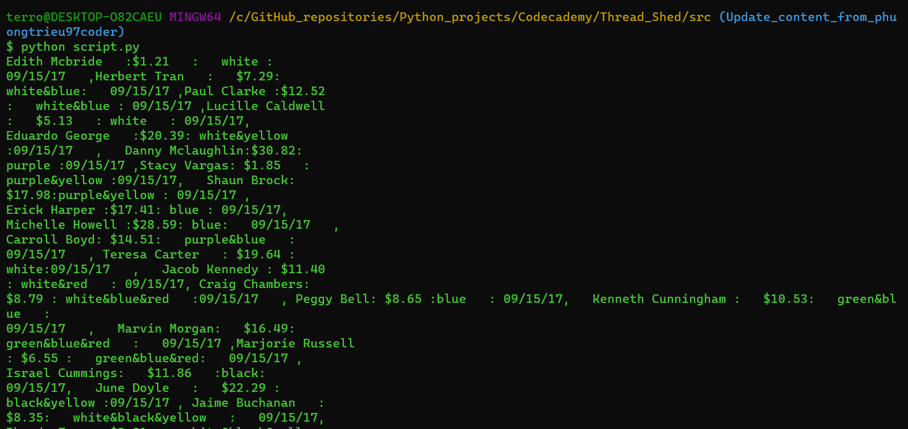
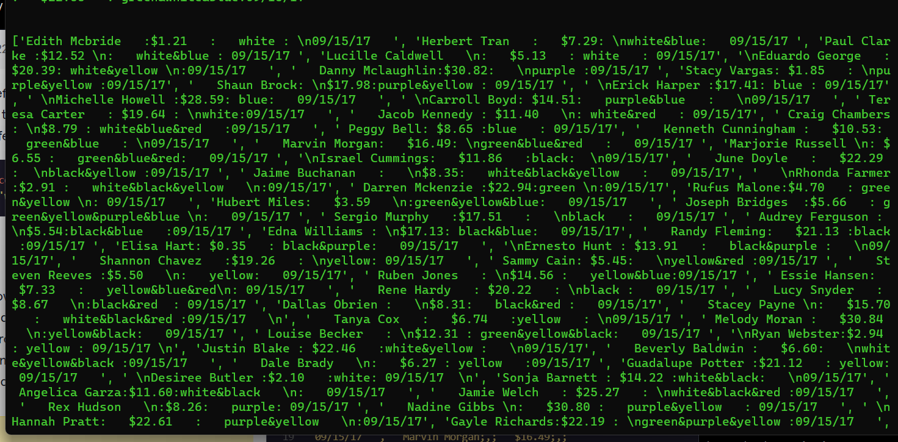
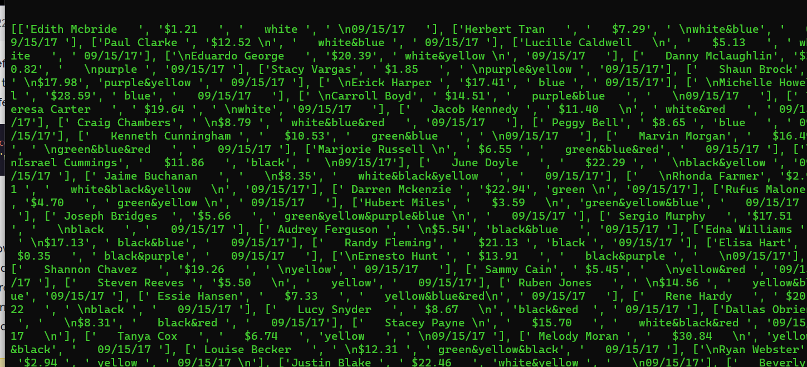
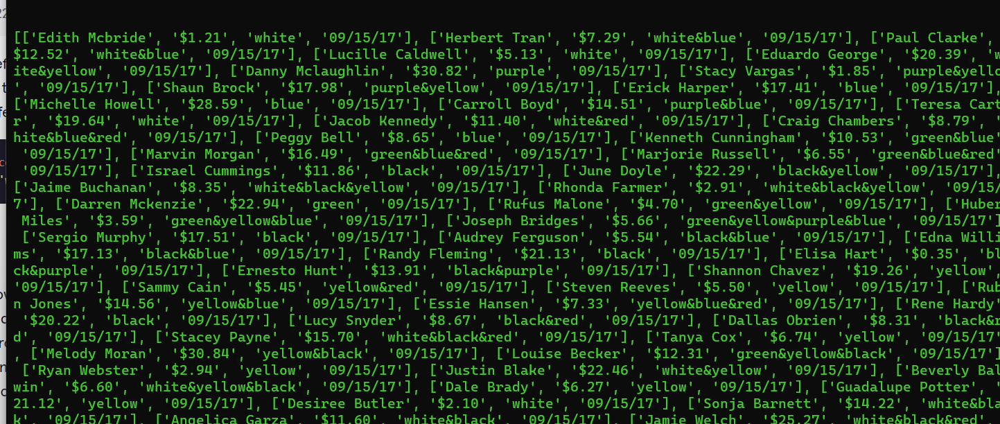
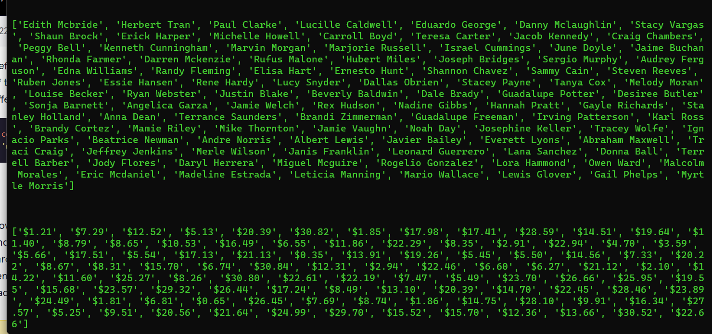
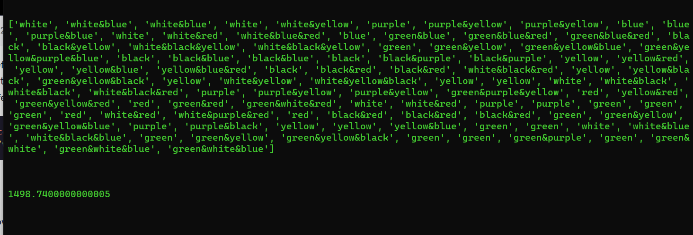
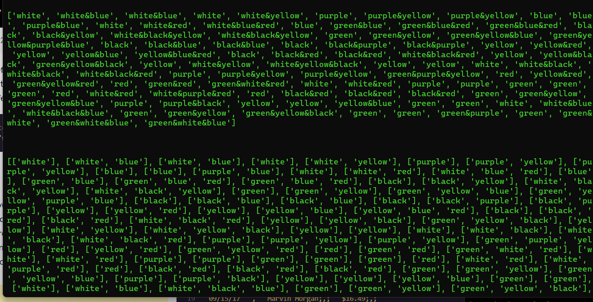
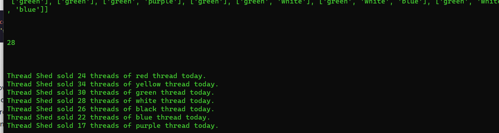

# 


 <a type="button" title="Codecademy_Learn_Python3_Course_button" href="https://www.codecademy.com/courses/learn-python-3/projects/thread-shed" target="_blank" data-CodecademyLearnPython3CourseButt="CodecademyLearnPython3CourseButt_data"></a>


<br><br>


# Thread Shed

# 1. Introduction:
You’ve recently been hired as a cashier at the local sewing hobby shop, <b>Thread Shed</b>. Some of your daily responsibilities involve tallying the number of sales during the day, calculating the total amount of money made, and keeping track of the names of the customers.

Unfortunately, the <b>Thread Shed</b> has an extremely outdated register system and stores all of the transaction information in one huge unwieldy string called <b>daily_sales</b>.

All day, for each transaction, the name of the customer, amount spent, types of thread purchased, and the date of sale is all recorded in this same string. Your task is to use your Python skills to iterate through this string and clean up each transaction and store all the information in easier-to-access lists.

# 2. Output:

## \*Notice\*: <b style="color:red">I have cut down on a lot information from the output pictures below to make it shorter to read</b>.









# 3. Prompts:

### Break up \`daily_sales\` in easy to understand lists \`customers\`, \`sales\`, and \`thread_sold\`.

<br>

> 1. First, take a minute to inspect the string <b>daily_sales</b> in the code editor.<br><br>
How is each transaction stored? How is each piece of data within the transaction stored?<br><br>
Start thinking about how we can split up this string into its individual pieces of data.

<br>

> 2. It looks like each transaction is separated from the next transaction by a <b>,</b>, and then each piece of data within a transaction is separated by the artifact <b>;,;</b>.<br><br>
If we want to split up <b>daily_sales</b> into a list of individual transactions, we are going to want to split by <b>,</b>, but first, we need to replace the artifact <b>;,;</b> to something without a comma, so we don’t split any transactions themselves.<br><br>
Replace all the instances of <b>;,;</b> in <b>daily_sales</b> with some other character and save the result to <b>daily_sales_replaced</b>.
```python
daily_sales_replaced = daily_sales.replace(';,;',':')
print(daily_sales_replaced) 
```

<br>


> 3. Now we can split the string into a list of each individual transaction.<br><br>
Split <b>daily_sales_replaced</b> around commas and save it to a new list <b>daily_transactions</b>.
```python
daily_transactions = daily_sales_replaced.split(',') 
```

<br>

> 4. Print <b>daily_transactions</b>.

<br>

> 5. Our next step is to split each individual transaction into a list of its data points.<br><br>
First, define an empty list <b>daily_transactions_split</b>
```python
daily_transactions_split= []
```

<br>

> 6. Now, iterate through <b>daily_transactions</b> (remember, this is a list of strings currently), and for each transaction, split the string around whatever character you replaced the <b>;,;</b> artifacts with in <b>Step 2</b>.<br><br>
Append each of these split strings (which are lists now) to our new list <b>daily_transactions_split</b>.
```python
for i in daily_transactions:
  daily_transactions_split.append(i.split(':'))
print(daily_transactions_split)
```
<br>

> 7. Print <b>daily_transactions_split</b>.

<br>

> 8. It looks like each data item has inconsistent whitespace around it. First, define an empty list <b>transactions_clean</b>.<br><br> 
Now, Iterate through <b>daily_transactions_split</b> and for each transaction iterate through the different data points and strip off any whitespace.<br><br>
Add each of these cleaned up transactions to the new list <b>transactions_clean</b>.
```python
transactions_clean = []
for dts in daily_transactions_split:
  transactions_clean_child = []
  for dts_child in dts:
    transactions_clean_child.append(dts_child.strip())
  transactions_clean.append(transactions_clean_child)
print(transactions_clean)
```
<br>

> 9. Print <b>transactions_clean</b>.<br><br>
If you performed the last step correctly, you shouldn’t see any unnecessary whitespace.

<br>

> 10. Create three empty lists. <b>customers</b>, <b>sales</b>, and <b>thread_sold</b>. We are going to collect the individual data points for each transaction in these lists.
```python
customers = []
sales = []
thread_sold = []
```
<br>

> 11. Now, iterate through <b>transactions_clean</b> and for each transaction:<br><br>
>> 1. Append the customers name to <b>customers</b>.
>> 2. Append the amount of the sale to <b>sales</b>.
>> 3. Append the threads sold to <b>thread_sold</b>.
```python

for tc in transactions_clean:
  customers.append(tc[0])
  sales.append(tc[1])
  thread_sold.append(tc[2])
print(customers)
print("\n\n")

print(sales)
print("\n\n")

print(thread_sold)
print("\n\n")


```
<br>

> 12. Print <b>customers</b>, <b>sales</b>, and <b>thread_sold</b> to make sure each list is what you are expected.

### Determine the total value of the days sales.

<br>

> 13. Now we want to know how much Thread Shed made in a day.<br><br>
First, define a variable called <b>total_sales</b> and set it equal to <b>0</b>.
```python
total_sales = 0
```

<br>

> 14. Now, consider the list <b>sales</b>. It is a list of strings that we want to sum. In order for us to sum these values, we will have to remove the <b>\$</b>, and set them equal to floats. <br><br>
Iterate through <b>sales</b> and for each item, strip off the <b>\$</b>, set it equal to a float, and add it to <b>total_sales</b>
```python
total_sales = 0
for num in sales:
  sale_num = num.strip('$')
  total_sales+= float(sale_num)
print(total_sales)
```
<br>

> 15. Print <b>total_sales</b>.
<br>

### How much thread of any specific color was sold?

> 16. Finally, we want to determine how many of each color thread we sold today. Let’s start with a single color, and then we’ll generalize it.<br><br>
First, print out <b>thread_sold</b> and inspect it.

<br>

> 17. We see that <b>thread_sold</b> is a list of strings, some are single colors and some are multiple colors separated by the <b>&</b> character.<br><br>
The end product we want here is a list that contains an item for each color thread sold, so no strings that have multiple colors in them.<br><br>
First, define an empty list <b>thread_sold_split</b>.
```python
thread_sold_split=[]
```
<br>

> 18. Next, iterate through thread_sold. For each item, check if it is a single color or multiple colors. If it is a single color, append that color to <b>thread_sold_split</b>.<br><br>
If it is multiple colors, first split the string around the <b>&</b> character and then add each color individually to <b>thread_sold_split</b>.
```python
for tss in thread_sold:
  if '&' not in tss:
    thread_sold_split.append([tss])
  if '&' in tss:
    thread_sold_split.append(tss.split('&'))
  
print(thread_sold_split)
```
<br>

> 19. Great, now we have a list <b>thread_sold_split</b> that contains an entry with the color of every thread sold today.<br><br>
Define a function called <b>color_count</b> that takes one argument, <b>color</b>. The function should iterate through <b>thread_sold_split</b> and count the number of times the item is equal to argument, <b>color</b>. Then, it should return this count.
```python
def color_count(color):
  same_num_count = 0
  for tss in thread_sold_split:
    for tss_child in tss:
      if tss_child == color:
        same_num_count+=1 
  return same_num_count
```
<br>

> 20. Test your new function by running <b>color_count('white')</b>.<br><br>
Your function should return <b>28</b>.
```python
print(color_count('white'))
```
<br>

> 21. Define a list called <b>colors</b> that stores all of the colored threads that Thread Shed offers:
```python
colors = ['red', 'yellow', 'green', 'white', 'black', 'blue', 'purple']
```

> 22. Now, using the string method <b>.format()</b> and the function <b>color_count()</b>, iterate through the list <b>colors</b> and print a sentence that says how many threads of each color were sold today.<br><br>
The output of this function should look like:<br><br>
Thread Shed sold 28 threads of white thread today.
```python
colors = ['red', 'yellow', 'green', 'white', 'black', 'blue', 'purple']

for c in colors:
  print('Thread Shed sold {} threads of {} thread today.'.format(color_count(c),c))
```


